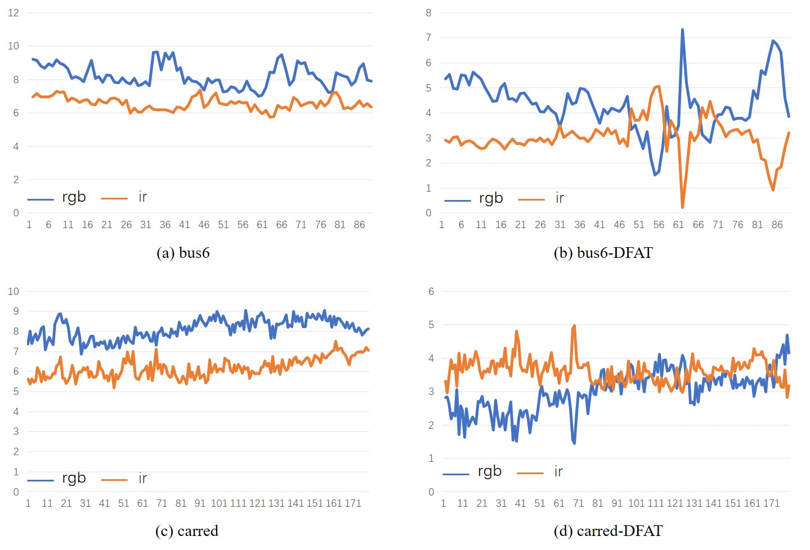

# DFAT

**The official implementation of the Information Fusion paper "Exploring Fusion Strategies for Accurate RGBT Visual Object Tracking".**

It is supported by the PRCI-Lab (https://github.com/PRCI-Lab)

## Introduction
Based on the [pysot](https://github.com/STVIR/pysot), DFAT  mainly focus on the bias caused by the different imaging mechanism.

  
  
Illustration of databias

### Download models
The used model can be downloaded from [baidu_disk](https://pan.baidu.com/s/1doi2aAGKRhh7ik7vIWLP2w). CODE:nfbe

### Download testing datasets
Testing dataset like GTOT, RGBT210, RGBT234 can be downloaded from [Chenglong Li's website](http://chenglongli.cn/code-dataset/)

VOT-RGBT2019 and VOT-RGBT2020 datasets can be downloaded from [baidu_disk](https://pan.baidu.com/s/1fLw4_vgV6DnIQeN3T-HESw). CODE:bcyo
### Eval tracker
For VOT toolkit: python_siam_base.py

For testing: python test_gtot.py/test_vot.py

### RFN
The RFN block is introduced from [RFN-Nest](https://github.com/hli1221/imagefusion-rfn-nest)
## Contributors

- [Zhangyong Tang](https://github.com/Zhangyong-Tang/)
 
